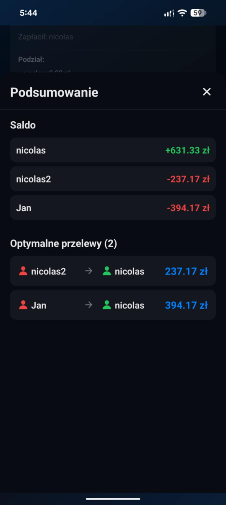
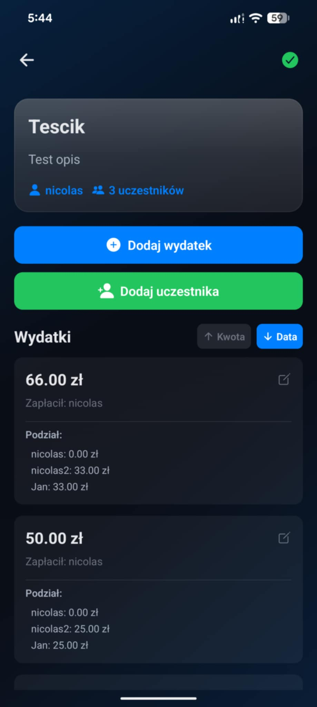

# Billow — effortless shared bills for real-life events

Make group expenses painless. Create an event, invite friends, log purchases from anyone, and close the loop with an **optimized set of transfers** so nobody has to do mental math or send ten tiny payments.

  

---

## Table of Contents

- [Features](#features)
- [Screenshots](#screenshots)
- [How It Works](#how-it-works)
- [Tech Stack](#tech-stack)
- [Project Structure](#project-structure)
- [Getting Started](#getting-started)
  - [Prerequisites](#prerequisites)
  - [Environment Variables](#environment-variables)
  - [Backend Setup (FastAPI)](#backend-setup-fastapi)
  - [Mobile App Setup (React Native + Expo)](#mobile-app-setup-react-native--expo)
- [Core API Endpoints](#core-api-endpoints)
- [Data Model Overview](#data-model-overview)
- [Workflows](#workflows)
  - [Create Event & Invite Friends](#create-event--invite-friends)
  - [Add Expenses](#add-expenses)
  - [Close Event & Settle Up](#close-event--settle-up)
- [Roadmap](#roadmap)
- [Contributing](#contributing)
- [License](#license)

---

## Features

- **Event-based splitting**: Track trips, parties, meetups—anything with a clear start and finish.
- **Everyone can add expenses**: Any participant can log what they paid; the event owner can edit and finalize.
- **Smart settlement**: Generates the **minimum number of transfers** that settles all balances.
- **Friends & invites**: Search, add, accept/decline friend requests, and invite friends to events quickly.
- **Role-aware controls**: Event owner manages expenses and membership, and can close the event when everything’s settled.
- **Clear history**: See events you’re in—past and ongoing—right in your profile.

---

## Screenshots

### Optimized Bills Summary
Shows the minimal set of transfers required to settle the event, avoiding unnecessary back-and-forth.

### Event Page
The owner can modify any expense, add or remove people, and close the event when done. Every participant can add expenses at any time until the event is closed.

### Friend Search
Fast friend lookup to invite people to your events.

### User Profile
Accept or decline friend requests and see the events you’re in (past and ongoing).

---

## How It Works

At close-time, the app computes each participant’s **net balance** per event:

- `net = paid_total - should_pay_total`
- Positive `net` = others owe you
- Negative `net` = you owe others

A greedy matcher then pairs debtors with creditors to produce **as few transfers as possible**:

1. Split participants into `debtors` (negative) and `creditors` (positive).
2. Sort both lists by absolute balance.
3. Repeatedly match the top debtor with the top creditor for the **min(abs(debt), abs(credit))** amount.
4. Record a single transfer, reduce balances, remove whoever hits zero, and continue.

This yields a compact, human-friendly settlement plan.

---

## Tech Stack

- **Backend**: Python, FastAPI, Pydantic, SQLAlchemy/SQLModel, PostgreSQL
- **Auth**: JWT (access/refresh) stored in secure store
- **Mobile App**: React Native, Expo Router, TypeScript

--------